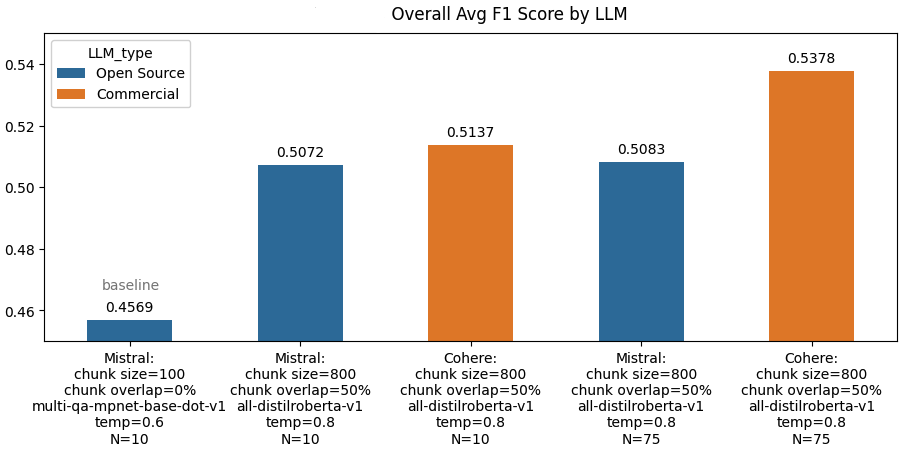

# DATASCI 290: Generative AI
## UC Berkeley School for Information
## Optimizing Retrieval-Augmented Generation Systems: Evaluation Techniques and Insights 
This repository contains sample code implementations and the write-up for the Generative AI Final Project. Enclosed within are assorted Jupyter notebooks, datasets, code implementations, and documentation reflecting our combined exploration of various visualization techniques, methodologies, and the extraction of insightful conclusions.

### Abstract
This project explores the development of a proof-of-concept Retrieval Augmented Generation (RAG) system utilizing LangChain and various language models, including Mistral and Cohere. The system tailors responses for technical and non-technical users, evaluated using metrics such as BERT Score, ROUGE, and SQuAD. Results indicate that commercial models generally outperform open-source models, though the improvements are marginal.

### Contents

- The [jupyter notebook](2024_Summer_GenAI290_assignment_V_Analysis.ipynb) contains the aggregated results used for the final write-up.

- The *final write-up* provides a comprehensive summary of the research, methodologies and findings. 

